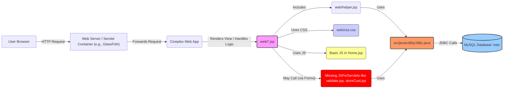

# Awesome Kartikey Cineplex - System Architecture

## 1. Overview

Awesome Kartikey Cineplex is a Java Web Application built primarily using JavaServer Pages (JSP) and JDBC. It follows a relatively simple architecture, likely leaning towards **Model 1** or a basic **Model 2 (MVC)** pattern, although the controller components (Servlets) are not explicitly present in the provided files.

The application interacts with a MySQL database for data persistence, uses Apache Ant for building, and is designed to be deployed on a Java EE compliant web server like GlassFish or Tomcat.



## 2. Project Folder Structure

```
cineplex/
├── build.xml
├── lib/
│   ├── nblibraries.properties
│   ├── CopyLibs/
│   ├── javaee-endorsed-api-6.0/
│   └── MySQLDriver/
├── nbproject/
│   ├── ant-deploy.xml
│   ├── build-impl.xml
│   ├── project.properties
│   ├── project.xml
│   └── private/
├── src/
│   ├── conf/
│   │   └── MANIFEST.MF
│   └── java/
│       └── utility/
│           └── Jdbc.java
└── web/
    ├── css.css
    ├── header.jsp
    ├── helper.jsp
    ├── Home.jsp
    ├── index.html
    ├── menu.jsp
    ├── SignIn.jsp
    ├── SignUp.jsp
    ├── Support.jsp
    ├── Trailers.jsp
    ├── homeSlider/
    └── WEB-INF/
        └── beans.xml
```

## 3. Major Components

- **Presentation Layer (View):**

  - Located primarily in the `web/` directory.
  - Consists of **JSP files** (`Home.jsp`, `SignIn.jsp`, `Trailers.jsp`, etc.) responsible for generating the HTML sent to the user's browser.
  - Uses **CSS** (`css.css`) for styling.
  - Includes minimal **JavaScript** (e.g., slider in `Home.jsp`).
  - Uses JSP include directives (`<%@ include file="..." %>`) and potentially scriptlets (`<% ... %>` as seen in `helper.jsp`, `Trailers.jsp`) for dynamic content generation and embedding logic.
  - `helper.jsp` contains reusable Java methods embedded directly within the JSP, often used for fetching data for dropdowns or lists.

- **Data Access Layer (Model/Utility):**

  - `src/java/utility/Jdbc.java`: A utility class providing static methods to interact with the MySQL database using standard JDBC. It handles obtaining connections, creating statements, executing queries/updates, and closing resources. It does _not_ use connection pooling or `PreparedStatement` (potential performance and security issues).
  - **MySQL Database:** The external relational database (`ostc`) storing all persistent data (users, movies, cities, halls, showtimes, etc.).

- **Controller Layer (Implicit/Missing):**

  - The architecture seems to rely heavily on JSPs handling both view and some logic (Model 1 style) or expects specific JSPs (`validate.jsp`, `storeCust.jsp`) to act as controllers when forms are submitted.
  - In a more robust Model 2 MVC approach, Java Servlets would typically handle incoming requests, interact with the data layer, prepare data, and then forward the request to a JSP for rendering. These servlet components are missing from the provided files.

- **Build System:**

  - **Apache Ant** (`build.xml`, `nbproject/build-impl.xml`): Used to compile Java code, copy resources, and package the application into a deployable WAR (Web Application Archive) file. The build process is tightly integrated with the NetBeans IDE structure.

- **Libraries (`lib/`):**
  - Contains necessary external dependencies like the MySQL JDBC driver and Java EE APIs.

## 4. Data Flow Example (User Sign Up)

1.  **Request:** User navigates to the site (e.g., `Home.jsp`). `header.jsp` is included.
2.  **Interaction:** User hovers over the "Sign Up" link in `header.jsp`. CSS (`css.css`) makes the form defined in `SignUp.jsp` visible.
3.  **Submission:** User fills the form in `SignUp.jsp` and clicks submit. The form action is set to `storeCust.jsp` (method POST).
4.  **Processing (Hypothetical - `storeCust.jsp` is missing):**
    - The server receives the POST request for `storeCust.jsp`.
    - `storeCust.jsp` (or a Servlet it might call) retrieves the submitted form parameters (name, contact, email, password, etc.) using the `request` object.
    - It performs basic validation (e.g., check if passwords match).
    - It calls `Jdbc.getConnection()` and `Jdbc.getStatement()` from `utility.Jdbc`.
    - It constructs an SQL `INSERT` statement (e.g., `INSERT INTO users (name, contact, email, password) VALUES ('...', '...', '...', '...')`). **Security Risk:** If user input is directly concatenated into the SQL string, this is vulnerable to SQL Injection. Password should also be hashed here.
    - It executes the statement using `Jdbc.executeUpdate()`.
    - It closes the statement and connection using `Jdbc.closeStatement()` and `Jdbc.closeConn()`.
5.  **Response:** `storeCust.jsp` redirects the user to a confirmation page or back to the homepage, possibly with a success/error message.

## 5. Design Decisions (Inferred)

- **JSP-Centric Design:** The application heavily relies on JSPs for rendering views and embedding presentation logic, characteristic of older Java web development practices or simpler applications (Model 1). Helper methods are included directly in `helper.jsp` rather than separate utility classes in `src/java`.
- **Direct JDBC Usage:** Opting for manual JDBC calls via a basic utility class (`Jdbc.java`) instead of using an ORM (Object-Relational Mapper like Hibernate/JPA) or a more abstract DAO (Data Access Object) pattern. This simplifies setup for basic tasks but increases boilerplate code and potential for errors (resource leaks, SQL injection).
- **Hardcoded Configuration:** Database credentials and connection details are hardcoded directly into `Jdbc.java`, which is poor practice for security and maintainability.
- **NetBeans/Ant Integration:** The project structure and build files are standard for a NetBeans Java Web project using Ant, suggesting the IDE played a significant role in its creation.
- **Minimalistic Frontend Interaction:** Relying on CSS hover effects for form display (`SignIn.jsp`, `SignUp.jsp`) rather than more interactive JavaScript approaches.